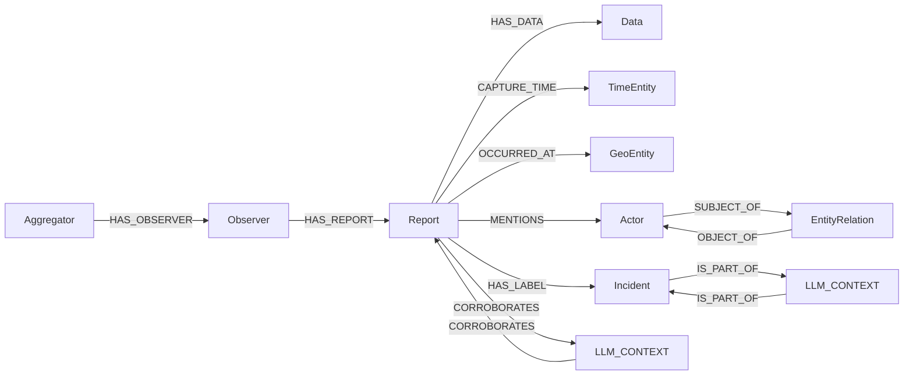

# SIGMUS ontology

This document describes the graph that SIGMUS currently stores in Neo4j. It is
the authoritative description of the implemented ontology.

SIGMUS separates an observation's provenance from its contents:

- `Aggregator`, `Observer`, and `Report` describe where an observation came from.
- `Data`, `TimeEntity`, and `GeoEntity` describe what was observed, when, and where.
- `Actor` and `EntityRelation` describe real-world entities mentioned by a report.
- `Incident` represents a confirmed incident introduced by a news report.
- `LLM_CONTEXT` records the evidence behind an inferred graph connection.

Detector labels on sensor observations are candidates, not confirmed incidents.
They remain in `Data.annotations` and do not create `Incident` nodes.

## Graph overview

Cardinalities below describe the intended SIGMUS model. Neo4j does not enforce
all of them automatically, so ingestion code is responsible for maintaining
them.

## Nodes

### Aggregator

An external service or data source that collects observations, such as GDELT,
AlertCalifornia, or the CCTV collector.

- Identity: source name.
- One aggregator can have many observers.
- Each observer belongs to one aggregator.

### Observer

The sensor, camera, account, station, or other producer that made an observation.

- Identity: observer name together with source name.
- One observer can produce many reports.
- Each report is produced by one observer.
- An observer's source location is represented on its reports, not on the
  `Observer` node.

### Report

The provenance record for one observation. It identifies the source, observer,
observation time, coordinates, summary, and optional event metadata.

- Identity: `observation_id`.
- Each report has exactly one `Data` node.
- Each report has exactly one `TimeEntity` node.
- Each report has zero or one `GeoEntity` node.
- A report can mention zero or many actors.
- A news report can label zero or many confirmed incidents.
- A report can participate in zero or many inferred connections.

Annotations do not live on `Report`; they live on its `Data` node.

### Data

The observation's payload and enrichment output.

It stores:

- Source values in `data_val`.
- Enrichment output in `annotations`.
- File and raw-source references.
- Anomaly score and anomaly status.
- Enrichment status.

Each `Data` node belongs to exactly one report. A report has exactly one `Data`
node even when the observation contains several values or files; those values
and files are kept together inside that node.

### TimeEntity

The time interval associated with a report.

- Each report has exactly one `TimeEntity`.
- `start_time` is the observation time.
- `end_time` is the supplied end time, or the observation time for an instant.

### GeoEntity

The location of a report.

- It is created only when latitude and longitude are available.
- Each report has at most one `GeoEntity`.
- It stores authoritative coordinates and may also store a readable address and
  geocoding provenance.
- Sensor coordinates take precedence over coordinates returned by a geocoder.

### Actor

A named real-world person, organization, group, or other entity mentioned in a
report.

- One report can mention many actors.
- One actor can be mentioned by many reports.
- Actor identity may be reconciled with an existing actor during ingestion.

Actor types may use CAMEO terminology, but SIGMUS does not currently validate
them against the CAMEO codebook.

### EntityRelation

A statement made by one report about two actors, such as “organization A
supports organization B.” It is a node rather than a direct edge so that the
observation ID and predicate can be retained.

- Each entity relation has exactly one subject actor.
- Each entity relation has exactly one object actor.
- One report may provide zero or many entity relations.
- Actors may participate in many entity relations.

### Incident

A specific real-world incident established by news evidence. Examples should be
event-specific names such as “2026 Downtown Los Angeles Warehouse Fire,” not
generic detector classes such as “fire.”

- Only news sources create `Incident` nodes.
- A news report can label zero or many incidents.
- An incident can be supported by many news reports.
- Two incidents may be connected through an inferred parent/child hierarchy.

An anomaly threshold crossing or a sensor's possible-incident label does not by
itself create an `Incident` node.

### LLM_CONTEXT

The recorded rationale for an inferred connection. Keeping the rationale as a
node prevents an LLM decision from looking like a directly observed fact.

There are two current forms:

- Cross-source evidence: connects exactly two reports with `CORROBORATES`.
- Incident hierarchy: connects exactly two incidents with `IS_PART_OF`.

A context node stores its kind and reason. Cross-source contexts also store
confidence, geographic distance, and time difference. Candidate reports are
filtered by time, distance, and source before an LLM is asked to choose links,
and ingestion creates no more than two links for one incoming report.

## Relationships

| Relationship | From | To | Meaning |
|---|---|---|---|
| `HAS_OBSERVER` | `Aggregator` | `Observer` | The source collects observations from this observer. |
| `HAS_REPORT` | `Observer` | `Report` | The observer produced this report. |
| `HAS_DATA` | `Report` | `Data` | The data and annotations belonging to the report. |
| `CAPTURE_TIME` | `Report` | `TimeEntity` | When the observation was made. |
| `OCCURRED_AT` | `Report` | `GeoEntity` | Where the observation was made. |
| `MENTIONS` | `Report` | `Actor` | The report refers to the actor. |
| `SUBJECT_OF` | `Actor` | `EntityRelation` | The actor is the subject of the statement. |
| `OBJECT_OF` | `EntityRelation` | `Actor` | The actor is the object of the statement. |
| `HAS_LABEL` | `Report` | `Incident` | A news report identifies the confirmed incident. |
| `CORROBORATES` | `Report` | `LLM_CONTEXT` | First half of a proposed cross-source evidence link. |
| `CORROBORATES` | `LLM_CONTEXT` | `Report` | Second half of a proposed cross-source evidence link. |
| `IS_PART_OF` | `Incident` | `LLM_CONTEXT` | The child side of an inferred incident hierarchy. |
| `IS_PART_OF` | `LLM_CONTEXT` | `Incident` | The parent side of an inferred incident hierarchy. |

## Values that are not node types

The following concepts are represented, but are not separate Neo4j node types:

- An event is stored as report properties and in `Data.annotations.event`.
- A modality is represented by the report's files and data values.
- Enrichment inference is stored in `Data.annotations`.
- The rationale for an inferred graph connection is represented by
  `LLM_CONTEXT`.
- Numeric measurements are stored in `Data.data_val` and in TimescaleDB.

The older `ontology.jpg` is a conceptual design and uses `Event`, `Modality`,
`Inference`, `Time`, and `Location` as independent classes. Those boxes should
not be interpreted as current Neo4j labels. In the implementation, their closest
equivalents are the representations listed above, `TimeEntity`, and `GeoEntity`.

## Extending the ontology

Before changing the graph, decide whether the new information is an attribute,
a node, or a relationship:

- Use an **attribute** when the value describes one existing object.
- Use a **node** when the thing has its own identity or will be shared by several
  reports.
- Use a **relationship** when the important fact is how two existing things are
  connected.

### Add an attribute

Most new source values should be added under the observation's `data` object.
Most new enrichment values should be added under `annotations`. SIGMUS already
stores both objects, so this requires no graph change.

If the attribute must be a directly searchable property on a graph node:

1. Add the value to `database_storage/observation.py`.
   This step carries it from the shared observation into SIGMUS's normalized
   storage record.
2. Add a parameter and `SET` assignment in `database_storage/graph.py`.
   This step writes the value onto the intended Neo4j node.
3. Add or update a projection test in `tests/test_graph_projection.py`.
   This step prevents ingestion from silently dropping the attribute later.

Example: a report-level `quality_score` would be normalized as
`record["quality_score"]`, passed as `$quality_score`, and assigned with
`rep.quality_score=$quality_score`.

### Add a node type

Use a node when several observations can refer to the same independently
identifiable thing—for example, a critical-infrastructure facility.

1. Define the input shape under `annotations`.
   This gives collectors and enrichment one consistent representation to
   produce, such as `{id, name, type}`.
2. Copy that structure into the normalized record in
   `database_storage/observation.py`.
   This makes the new information available to graph ingestion.
3. In `database_storage/graph.py`, `MERGE` the node using a stable identifier,
   set its descriptive properties, and connect it to the appropriate existing
   node.
   A stable identifier prevents two different things with similar names from
   being merged accidentally.
4. Add a graph-projection test covering the node, its identity, and its edge.
   This verifies both the shape and intended cardinality.

For example, an `Infrastructure` node could use `facility_id` as its identity
and connect from a report with `AFFECTS`.

### Add a relationship

1. Define its allowed start node, end node, direction, meaning, and cardinality.
   This prevents the same relationship name from acquiring several conflicting
   meanings.
2. Decide where the relationship evidence appears in `data` or `annotations`,
   then copy it into the normalized storage record.
   Ingestion needs an explicit, traceable input rather than guessing a link from
   unrelated fields.
3. Add a `MERGE` for the relationship in `database_storage/graph.py`.
   `MERGE` makes repeated ingestion idempotent instead of creating duplicate
   edges.
4. If the relationship is inferred rather than directly observed, connect the
   endpoints through an `LLM_CONTEXT` node and store the reason and confidence.
   This preserves provenance and distinguishes inference from fact.
5. Add a projection test that checks the endpoints, direction, and evidence.
   This protects the relationship's meaning as the ingestion code changes.

For every extension, prefer the smallest representation that answers the
required questions. Do not create a node when a simple attribute is sufficient,
and do not create an inferred relationship without retaining its evidence.
