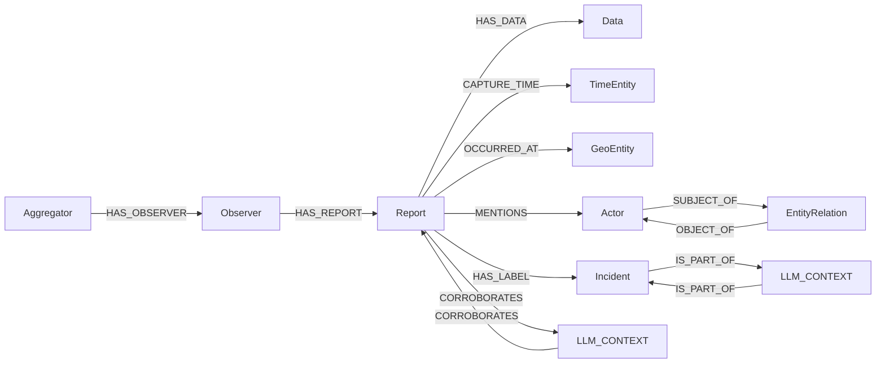
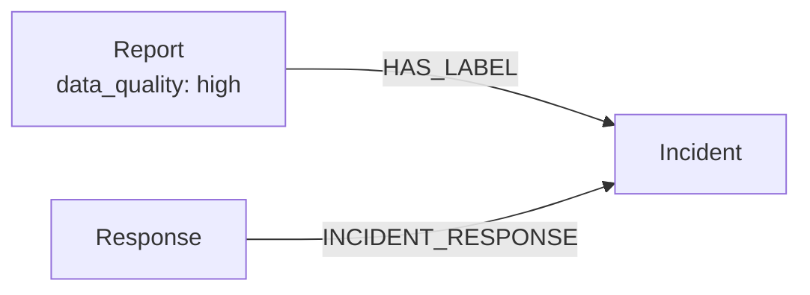

# SIGMUS ontology

This document describes the graph that SIGMUS currently stores in Neo4j. It is
the authoritative description of the implemented ontology.

SIGMUS separates an observation's provenance from its contents:

- `Aggregator`, `Observer`, and `Report` describe where an observation came from.
- `Data`, `TimeEntity`, and `GeoEntity` describe what was observed, when, and where.
- `Actor` and `EntityRelation` describe real-world entities mentioned by a report.
- `Incident` represents a confirmed incident introduced by a news report.
- `LLM_CONTEXT` records the evidence behind an inferred graph connection.

Detector labels on sensor observations are candidates, not confirmed incidents.
They remain in `Data.annotations` and do not create `Incident` nodes.

## Graph overview



Cardinalities below describe the intended SIGMUS model. Neo4j does not enforce
all of them automatically, so ingestion code is responsible for maintaining
them.

## Nodes

### Aggregator

An external service or data source that collects observations, such as GDELT,
AlertCalifornia, or the CCTV collector.

- Identity: source name.
- One aggregator can have many observers.
- Each observer belongs to one aggregator.

### Observer

The sensor, camera, account, station, or other producer that made an observation.

- Identity: observer name together with source name.
- One observer can produce many reports.
- Each report is produced by one observer.
- An observer's source location is represented on its reports, not on the
  `Observer` node.

### Report

The provenance record for one observation. It identifies the source, observer,
observation time, coordinates, summary, and optional event metadata.

- Identity: `observation_id`.
- Each report has exactly one `Data` node.
- Each report has exactly one `TimeEntity` node.
- Each report has zero or one `GeoEntity` node.
- A report can mention zero or many actors.
- A news report can label zero or many confirmed incidents.
- A report can participate in zero or many inferred connections.

Annotations do not live on `Report`; they live on its `Data` node.

### Data

The observation's payload and enrichment output.

It stores:

- Source values in `data_val`.
- Enrichment output in `annotations`.
- File and raw-source references.
- Anomaly score and anomaly status.
- Enrichment status.

Each `Data` node belongs to exactly one report. A report has exactly one `Data`
node even when the observation contains several values or files; those values
and files are kept together inside that node.

### TimeEntity

The time interval associated with a report.

- Each report has exactly one `TimeEntity`.
- `start_time` is the observation time.
- `end_time` is the supplied end time, or the observation time for an instant.

### GeoEntity

The location of a report.

- It is created only when latitude and longitude are available.
- Each report has at most one `GeoEntity`.
- It stores authoritative coordinates and may also store a readable address and
  geocoding provenance.
- Sensor coordinates take precedence over coordinates returned by a geocoder.

### Actor

A named real-world person, organization, group, or other entity mentioned in a
report.

- One report can mention many actors.
- One actor can be mentioned by many reports.
- Actor identity may be reconciled with an existing actor during ingestion.

Actor types may use CAMEO terminology, but SIGMUS does not currently validate
them against the CAMEO codebook.

### EntityRelation

A statement made by one report about two actors, such as “organization A
supports organization B.” It is a node rather than a direct edge so that the
observation ID and predicate can be retained.

- Each entity relation has exactly one subject actor.
- Each entity relation has exactly one object actor.
- One report may provide zero or many entity relations.
- Actors may participate in many entity relations.

### Incident

A specific real-world incident established by news evidence. Examples should be
event-specific names such as “2026 Downtown Los Angeles Warehouse Fire,” not
generic detector classes such as “fire.”

- Only news sources create `Incident` nodes.
- A news report can label zero or many incidents.
- An incident can be supported by many news reports.
- Two incidents may be connected through an inferred parent/child hierarchy.

An anomaly threshold crossing or a sensor's possible-incident label does not by
itself create an `Incident` node.

### LLM_CONTEXT

The recorded rationale for an inferred connection. Keeping the rationale as a
node prevents an LLM decision from looking like a directly observed fact.

There are two current forms:

- Cross-source evidence: connects exactly two reports with `CORROBORATES`.
- Incident hierarchy: connects exactly two incidents with `IS_PART_OF`.

A context node stores its kind and reason. Cross-source contexts also store
confidence, geographic distance, and time difference. Candidate reports are
filtered by time, distance, and source before an LLM is asked to choose links,
and ingestion creates no more than two links for one incoming report.

## Relationships

| Relationship | From | To | Meaning |
|---|---|---|---|
| `HAS_OBSERVER` | `Aggregator` | `Observer` | The source collects observations from this observer. |
| `HAS_REPORT` | `Observer` | `Report` | The observer produced this report. |
| `HAS_DATA` | `Report` | `Data` | The data and annotations belonging to the report. |
| `CAPTURE_TIME` | `Report` | `TimeEntity` | When the observation was made. |
| `OCCURRED_AT` | `Report` | `GeoEntity` | Where the observation was made. |
| `MENTIONS` | `Report` | `Actor` | The report refers to the actor. |
| `SUBJECT_OF` | `Actor` | `EntityRelation` | The actor is the subject of the statement. |
| `OBJECT_OF` | `EntityRelation` | `Actor` | The actor is the object of the statement. |
| `HAS_LABEL` | `Report` | `Incident` | A news report identifies the confirmed incident. |
| `CORROBORATES` | `Report` | `LLM_CONTEXT` | First half of a proposed cross-source evidence link. |
| `CORROBORATES` | `LLM_CONTEXT` | `Report` | Second half of a proposed cross-source evidence link. |
| `IS_PART_OF` | `Incident` | `LLM_CONTEXT` | The child side of an inferred incident hierarchy. |
| `IS_PART_OF` | `LLM_CONTEXT` | `Incident` | The parent side of an inferred incident hierarchy. |

## Extending the ontology

Before changing the graph, decide whether the new information is an attribute,
a node, or a relationship. The examples below build one small extension:

- `Report.data_quality` describes the quality of a report.
- A `Response` node describes an action taken in response to an incident.
- `(:Response)-[:INCIDENT_RESPONSE]->(:Incident)` identifies the incident to
  which the response belongs.

Use an attribute when the value only describes an existing object. Use a node
when the thing has its own identity and properties. Use a relationship when the
important fact is how two nodes are connected.

Projection tests are recommended, but they do not make a Neo4j projection work.
The runtime changes are in `database_storage/observation.py` and
`database_storage/graph.py`. A test simply detects later changes that would
silently stop writing the new graph data. The three examples can be covered by
one small test rather than one test per change.

### Add an attribute: report data quality

Suppose enrichment supplies this value:

```json
{
  "annotations": {
    "data_quality": "high"
  }
}
```

To make it a searchable property on `Report`:

1. In `database_storage/observation.py`, add
   `"data_quality": annotations.get("data_quality")` to the record returned by
   `to_storage_record()`. This carries the value from the shared observation to
   graph ingestion.
2. In the `Report` query in `database_storage/graph.py`, add the query parameter
   `data_quality=record.get("data_quality")` and the assignment
   `rep.data_quality=$data_quality`. This stores the property in Neo4j.

The resulting graph data is:

```cypher
(:Report {observation_id: "report-123", data_quality: "high"})
```

No test change is required for this to run. A useful regression assertion is
that the projection query contains `rep.data_quality=$data_quality` and that
the supplied parameter is `"high"`.

### Add a node type: response

A response has its own identity and may later acquire properties such as the
responding organization, status, or start time, so it should be a node rather
than a property on `Incident`. For example, enrichment could supply:

```json
{
  "annotations": {
    "responses": [
      {
        "response_id": "response-456",
        "description": "Fire department dispatched",
        "status": "active",
        "incident_name": "2026 Downtown Warehouse Fire"
      }
    ]
  }
}
```

To project it:

1. In `database_storage/observation.py`, copy `annotations.responses` into a
   `responses` list in the normalized record. This makes the input available to
   graph ingestion.
2. In `database_storage/graph.py`, process each response after its corresponding
   `Incident` exists. Use `response_id` as its stable identity and set its
   descriptive properties. In this project, Cypher is written as a Python
   multiline string and executed by the Neo4j driver's `session.run()` method.
   Add a helper method to `Neo4jStore`:

```python
def _insert_responses(self, responses: list[dict]) -> None:
    for item in responses:
        response_id = item.get("response_id")
        if not response_id:
            continue
        with self.driver.session() as session:
            session.run("""
                MERGE (response:Response {response_id: $response_id})
                SET response.description=$description,
                    response.status=$status
            """, response_id=response_id,
                description=item.get("description"),
                status=item.get("status"))
```

3. In `insert_observation()`, immediately after the existing block that creates
   incidents, call:

```python
self._insert_responses(record.get("responses", []))
```

The indented text between `"""` markers is the Cypher query. The values after
the string are Python keyword arguments that become Cypher parameters such as
`$response_id`.

`response_id` is required because descriptions such as “Fire department
dispatched” are not unique. One incident may have many responses. Each response
belongs to exactly one incident in this simple model; create another response
node if the same action is recorded for a different incident.

No test is required for Neo4j to create the node. A regression test is still
helpful to confirm that `Response` is merged by `response_id` instead of by its
description.

### Add a relationship: incident response

Define the relationship as:

| Relationship | From | To | Meaning | Cardinality |
|---|---|---|---|---|
| `INCIDENT_RESPONSE` | `Response` | `Incident` | This response was made for this incident. | Each response has one incident; an incident can have many responses. |

This example uses information already copied into each `responses` item, so no
additional change to `database_storage/observation.py` is needed. Modify the
query inside `_insert_responses()` so that the existing `Incident` is matched
and the edge is merged in the same database call:

```python
session.run("""
    MATCH (incident:Incident {label: $incident_name})
    MERGE (response:Response {response_id: $response_id})
    SET response.description=$description,
        response.status=$status
    MERGE (response)-[:INCIDENT_RESPONSE]->(incident)
""", incident_name=item.get("incident_name"),
    response_id=response_id,
    description=item.get("description"),
    status=item.get("status"))
```

Use `MERGE`, rather than `CREATE`, so replaying an observation does not create
duplicate edges. `MATCH` also means that SIGMUS will not create an unconfirmed
incident merely because a response names it. The response and edge are created
only when an `Incident` with that label already exists. This relationship is
directly stated by the response input, so it does not need an `LLM_CONTEXT`
node. If SIGMUS inferred the connection instead, its reason and confidence
should be retained through `LLM_CONTEXT`.

Again, a test is not needed to make the relationship work. The same projection
test used for the attribute and node can assert that the query connects
`Response` to `Incident` in the documented direction.

The combined result looks like this:



For every extension, prefer the smallest representation that answers the
required questions. These examples require code changes because they create
directly queryable graph structure; values that only need to remain in the
original enrichment can stay inside `Data.annotations` without any projection
change.
